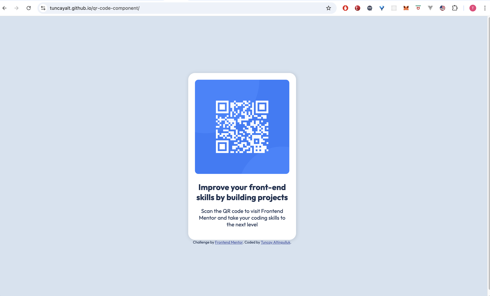

# Frontend Mentor - QR code component solution

This is a solution to the [QR code component challenge on Frontend Mentor](https://www.frontendmentor.io/challenges/qr-code-component-iux_sIO_H). Frontend Mentor challenges help you improve your coding skills by building realistic projects. 

## Table of contents

- [Overview](#overview)
  - [Screenshot](#screenshot)
  - [Links](#links)
- [My process](#my-process)
  - [Built with](#built-with)
  - [What I learned](#what-i-learned)
  - [Continued development](#continued-development)
  - [Useful resources](#useful-resources)
- [Author](#author)
- [Acknowledgments](#acknowledgments)

**Note: Delete this note and update the table of contents based on what sections you keep.**

## Overview

### Screenshot



### Links

- Solution URL: [https://github.com/tuncayalt/qr-code-component](https://github.com/tuncayalt/qr-code-component)
- Live Site URL: [https://tuncayalt.github.io/qr-code-component/](https://tuncayalt.github.io/qr-code-component/)

## My process

### Built with

- HTML
- CSS

### What I learned

How to center items
```css
.centering {
    display: flex;
    justify-content: center;
    align-items: center;
    height: 100vh;
}
```

### Continued development

I want to build projects with mobile focusing development


## Author

- Website - [Tuncay Altinpulluk](https://www.tuncayaltinpulluk.com)
- Frontend Mentor - [@tuncayalt](https://www.frontendmentor.io/profile/tuncayalt)
